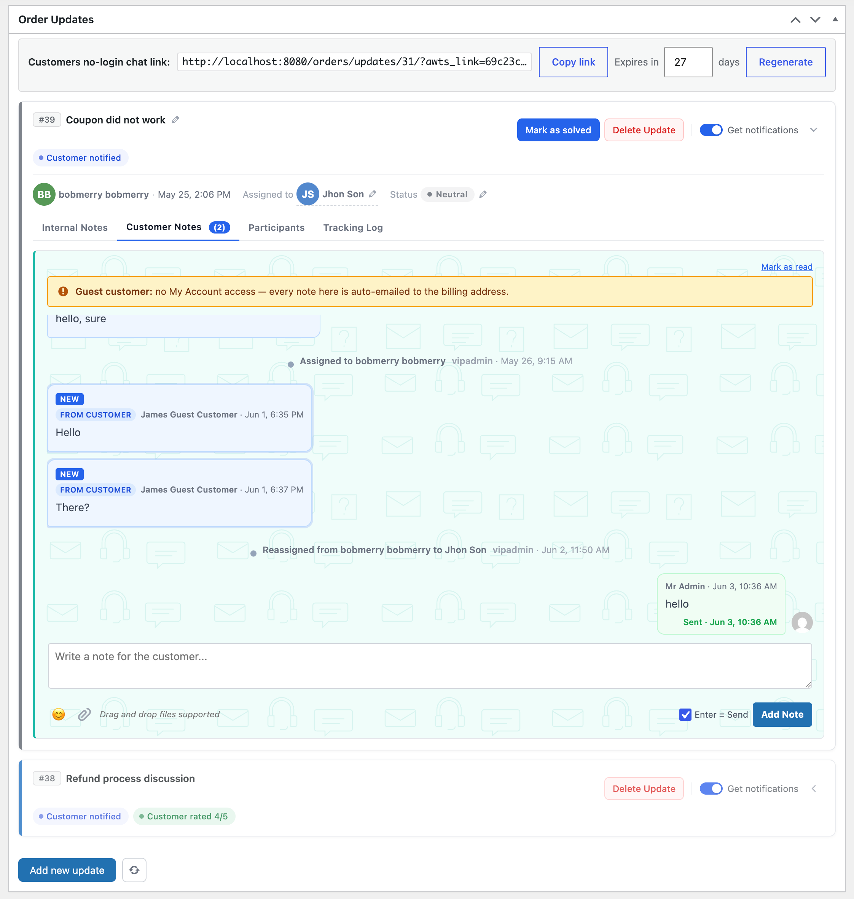
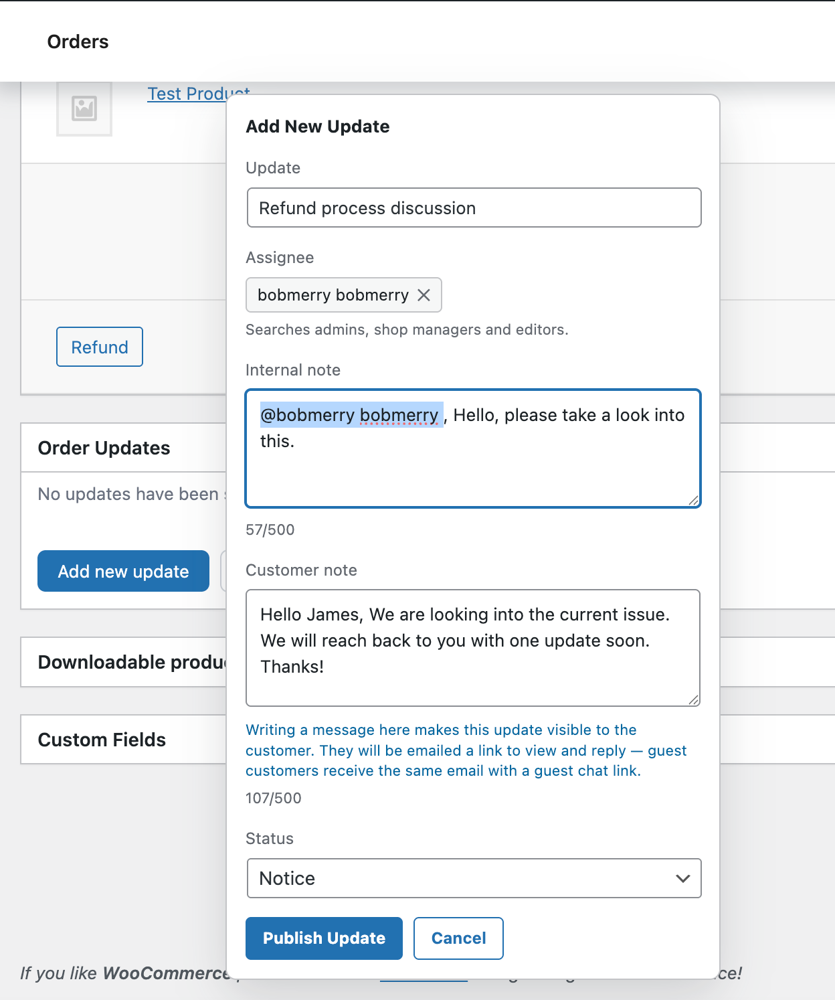
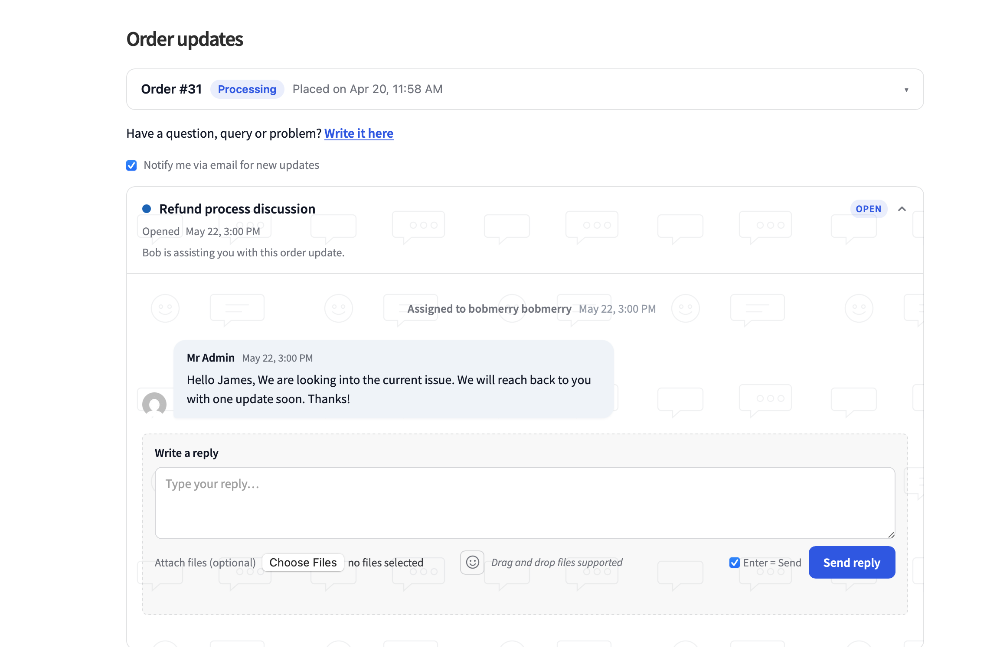
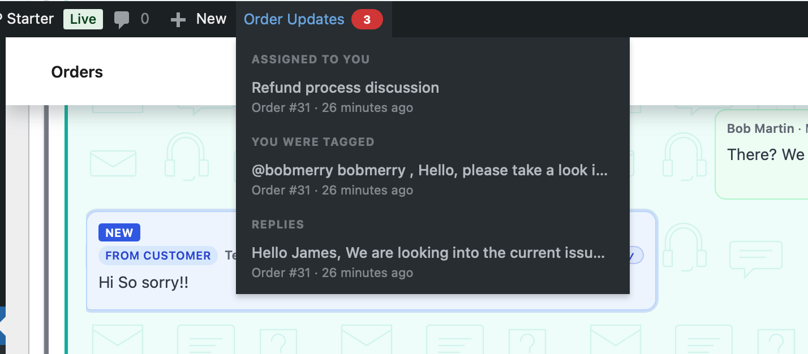
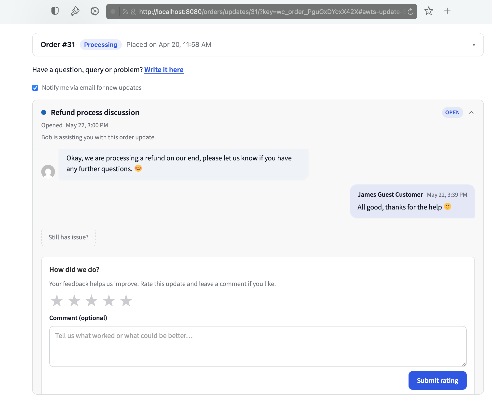
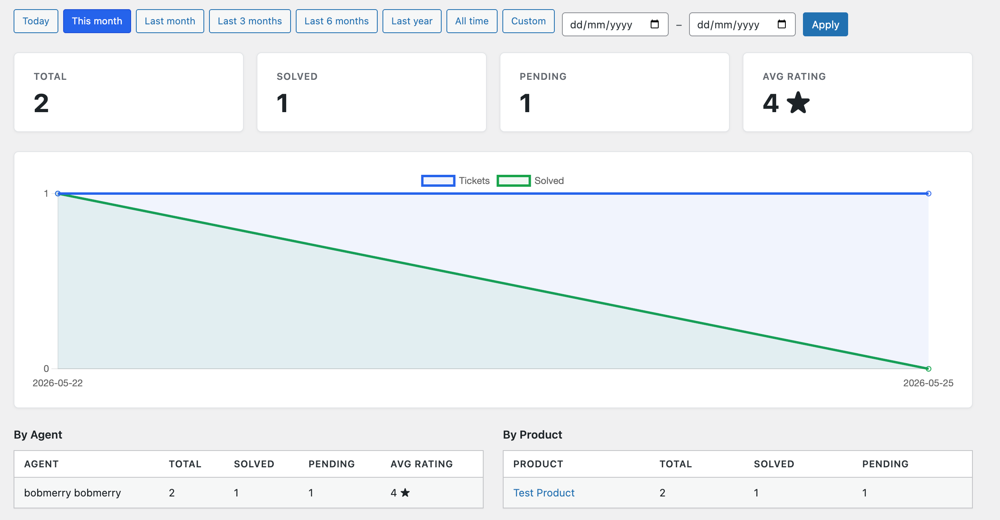
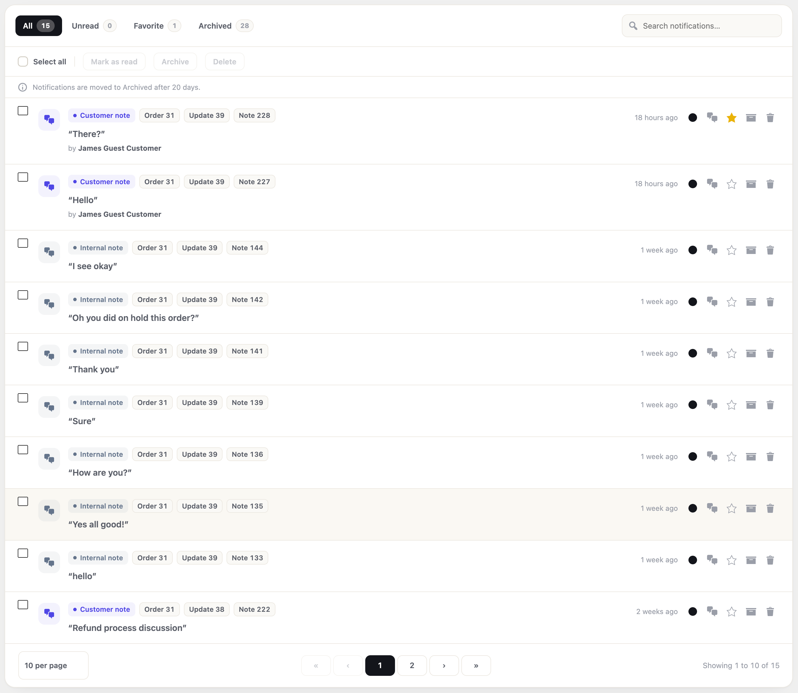
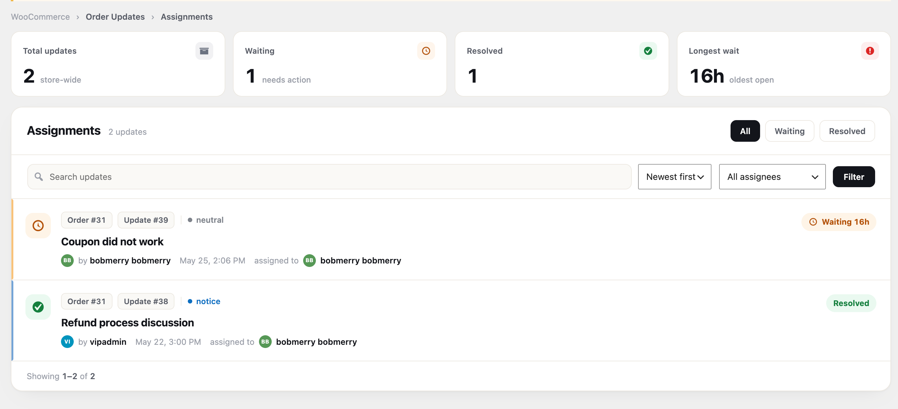
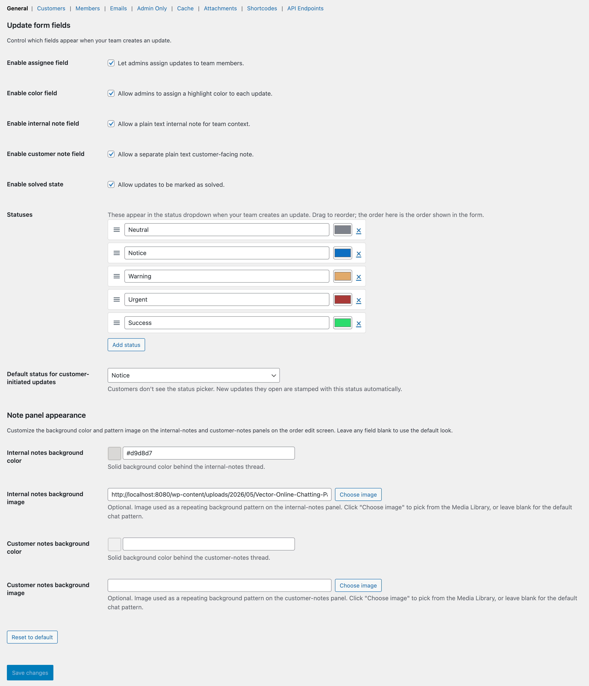

# Order Updates for WooCommerce

A full help-desk built into WooCommerce. Turn every order into a support thread — talk to the customer, loop in your team, share files, and collect a rating when the job is done. All inside your own WordPress, with no monthly fee and no third-party SaaS.

**Website:** [orderupdatesforwoo.com](https://orderupdatesforwoo.com) · **Features:** [orderupdatesforwoo.com/features](https://orderupdatesforwoo.com/features)



---

## What it does

- **Per-order threads** — every message about an order stays with the order, not in a separate inbox.
- **Customer portal** — customers reply from a simple page (logged in, or as a guest with a secure link).
- **Team @mentions** — tag a teammate and they get notified, even if they muted the thread.
- **Ratings** — ask for a star rating when an order is solved, with a follow-up email.
- **Attachments** — share files safely (signed URLs, MIME checks, no public folder).
- **Analytics** — see solved counts, average rating, and per-person scores.
- **HPOS-native** — works with WooCommerce High-Performance Order Storage.

---

## Requirements

- WordPress 6.5 or newer
- WooCommerce 8.0 or newer
- PHP 8.0 or newer

---

## Installation

Download **`order-updates-for-woo.zip`** from the [latest release](https://github.com/ankur0007/order-updates-for-woo/releases/latest). This zip is ready to use — no build step, no Composer.

1. In WordPress admin, go to **Plugins → Add New → Upload Plugin**.
2. Choose the zip and click **Install Now**.
3. Click **Activate**.

> [!CAUTION]
> Use the release zip, not the green **"Code → Download ZIP"** button. The source archive has no `vendor/` folder and will not run on its own.

Once the plugin is on WordPress.org, you will be able to search for it under **Plugins → Add New** and get updates the normal way.

---

## How to use it

### 1. Start an update on an order

Open any order and write the first message. Set a status, assign a teammate, and choose whether the customer can see it.



### 2. The customer replies

The customer sees a clean thread and can write back. Guests get a secure link — no account needed.



### 3. Your team stays in the loop

New messages show up in the admin bar, so staff notice them without hunting through orders.



### 4. Solve it and get a rating

Mark the update solved. The customer is asked for a star rating, and you can send a follow-up email.



### 5. Watch the numbers

The analytics page shows how many updates you solve, your average rating, and how each teammate is doing.



### The Notifications page

Every notification in one place — filter, mark as read, and clear. The unread count also shows on the menu so nothing slips by.



### Assignments at a glance

Each teammate sees their own queue with how long each update has waited; managers see the whole store, filterable by person.



### Settings

Everything is configurable — statuses, emails, customer access, attachments, and more.



See the [full feature tour](https://orderupdatesforwoo.com/features) on the website.

---

## Updates

Copies installed from a GitHub release check this repository for new versions, so you get the normal "update available" notice in WordPress. Once the plugin is listed on WordPress.org, updates come from there instead.

---

## Development

```bash
composer install      # PHP dependencies
npm install           # build tools for JS
composer test:unit    # run the unit tests
npm run build:js      # minify admin JS
```

Build a distributable zip:

```bash
bash scripts/build-dist.sh            # customer zip (with the GitHub updater)
bash scripts/build-dist.sh --wporg    # WordPress.org zip (updater stripped)
```

### Releasing

1. Bump the version in `order-updates-for-woo.php` and `readme.txt` (they must match).
2. Add a changelog entry.
3. Commit, then tag: `git tag v1.0.1 && git push --tags`.
4. The release workflow builds both zips and attaches them to the GitHub release.

---

## License

GPLv2 or later. See [license](https://www.gnu.org/licenses/gpl-2.0.html).

Built by [Ankur Vishwakarma](https://orderupdatesforwoo.com/about).
